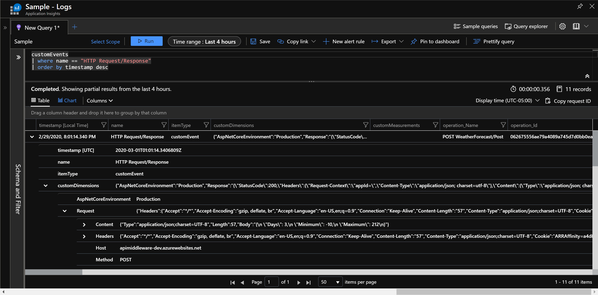

# ApiMiddleware
Helpful middleware for your ASP.NET Core APIs

## What is This?

I find myself rebuilding a lot of the same boilerplate code in my APIs, so I've decided to begin collecting the most useful middleware components into this library. The first one that I've implemented is one for logging the full contents of your HTTP Requests and Responses to Application Insights. Eventually, I plan to provide an implementation that uses Microsoft's ILogger instead or in addition to the TelemetryClient.

## Quick Start

In your Startup class, add the `UseRequestLogging` extension method (from the `Kenlefeb.Api.Middleware` namespace) to register the middleware.

```csharp
  public void Configure(IApplicationBuilder app, IWebHostEnvironment env)
  {
      if (env.IsDevelopment())
          app.UseDeveloperExceptionPage();

      app.UseHttpsRedirection();
      app.UseRouting();
      app.UseAuthorization();

      app.UseRequestLogging(options =>
      {
          options.EventName = "HTTP Request/Response";
          options.Capture.Request.Content = true;
          options.Capture.Response.Content = true;
      });

      app.UseEndpoints(endpoints =>
      {
          endpoints.MapControllers();
      });
  }
```

The options shown in this example are the only ones currently available and are being set to their default values. This sample 
code behaves the same as not including the options action at all:

```csharp

      app.UseRequestLogging();

```

This will result in CustomEvents being published to your currently configured Application Insights resource, such as the following screen shot:


